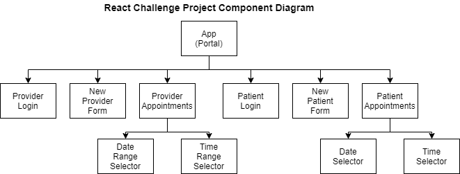

## React Challenge Project
 
This project will ask the learner to design an appointment portal that resembles those of medical offices like LabCorp and Quest Diagnostics. The portal will allow "Providers" to add appointment availability and "Patients" to reserve an available appointment. 
 
The project will ask the learner to continually implement content from, but not limited to the learning standards associated with the following lessons:
- [Intro to JSX](https://author.codecademy.com/content-items/02209fedc6d9228297d7d54c74b1d33c)
- [Your First React Component](https://author.codecademy.com/content-items/462b2d74c00cb710db030012cadbb7d8)
- [Components and Advanced JSX](https://author.codecademy.com/content-items/c5eb0ddeaaedc3e9d783be5d5086453c)
- [Components Render Other Components](https://author.codecademy.com/content-items/ac646ffc89a0dcf9f034df622a5ad025)
 
The design requirements in this project will push the learner to implement design choices and practices from, but not limited to the learning standards associated with the following lessons:
- [Advancded JSX](https://author.codecademy.com/content-items/97c23440228f1daf6309fd9ec6b85e61)
- [Function Components](https://author.codecademy.com/content-items/b03bb34292f81076e6edb7408188fded)
- [The State Hook](https://author.codecademy.com/content-items/598f56b0d099916d66930bb66d3e57a0)
- [The Effect Hook](https://author.codecademy.com/content-items/05bb935435e4bbe46a64b22531a6995f)
- [Child Components Update Their Parents' state](https://author.codecademy.com/content-items/5e1ae52999be671ce287d7472d42b31a)
- [Child Components Update Their Siblings' props](https://author.codecademy.com/content-items/f877d3b2ca20fc72232dd45dc166214f)
- [Container Components From Presentational Components](https://author.codecademy.com/content-items/84a2f32e30daabd9657afb25fb6d5d70)
- [React Forms](https://author.codecademy.com/content-items/dd9a3315ed0e1a64f0a6fec0335e0449)
 

 
The purpose of this design is to allow the learner to share as many components across both the Provider and the Patient sides of the portal. 
 
### App Component
 
The entry to the portal. The App component will have options to log in as a Provider or Patient and creating a new user of either type.
 
### Login Component
 
Allows the user, either Provider or Patient to log in. This component can be used for both sides of the app or used twice depending on the implementation. Provided data structures for app users may dictate if one or two components should be used, so it is important to not limit the learner's design choices with the provided data.
 
### New User Form Component
 
This can be a component shared across both sides of the app or two separate components. Different information will be asked whether the user is a Provider or a Patient. The data will be added to the application using a pseudo API included with the project.
 
### Appointments Component
 
Once logged in, the Provider page will allow the assignment of available appointment ranges through a date/time picker to be included with the project. These ranges will be added to the app data through a pseudo API included with the project.
 
When the patient logs in they can choose the provider and see the available times for appointments. Data on Providers should be included with the base code in case the learner wants to start with the patient end first as well as give an example of what the data should look like.
 
### Date/Time Component(s)
 
This component should wrap the included date/time plugin and change the behavior based on whether it is on the Provider side of the app or the Patient side. 